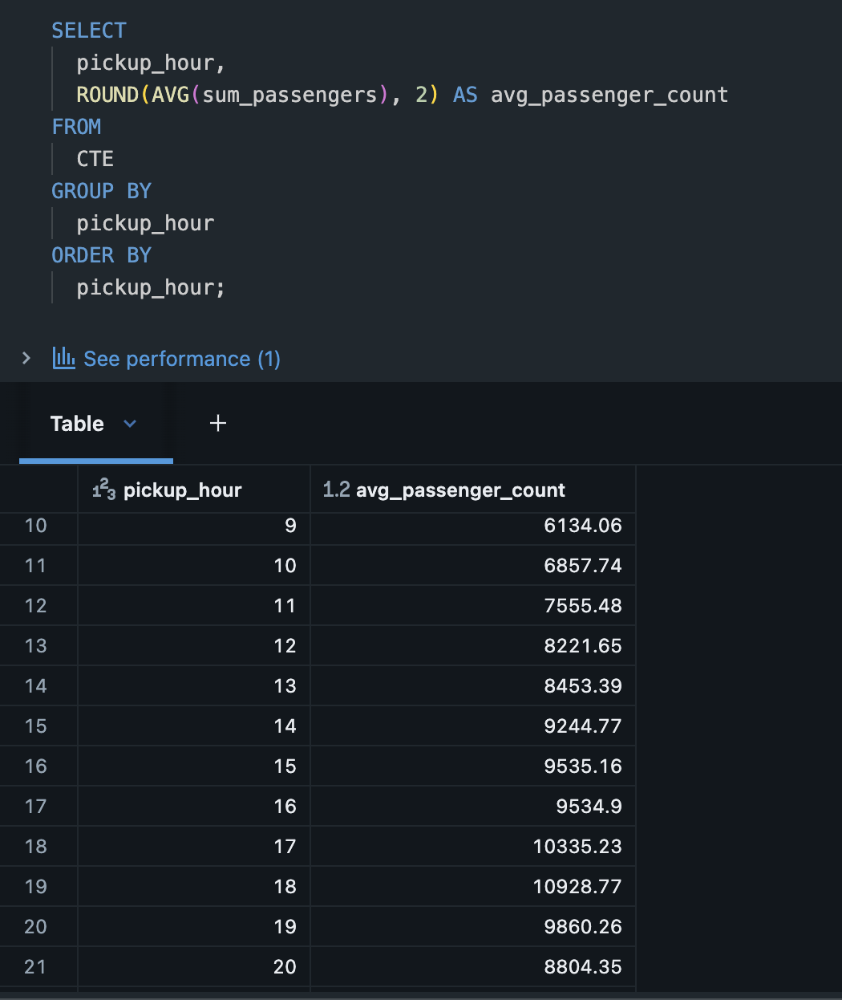
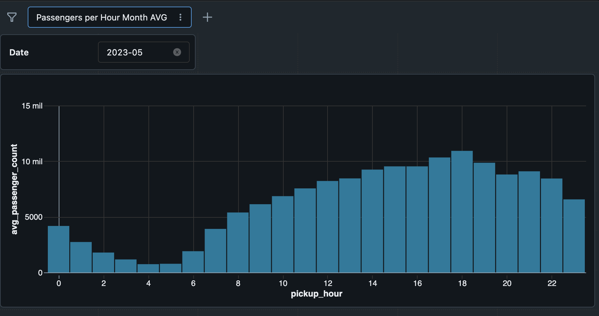
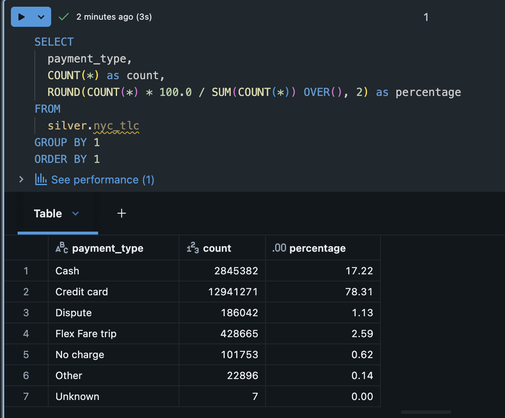
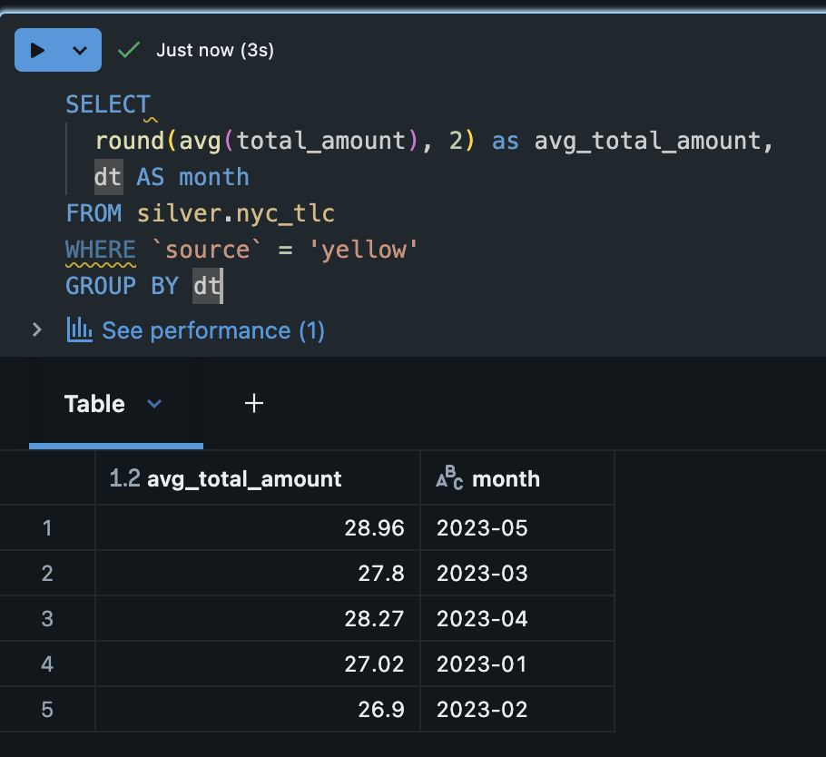

# DataLake Template Project

## Introdução ao Projeto

O projeto demonstra um pipeline completo de ETL (Extract, Transform, Load) para dados de táxis de Nova York, incluindo:

- **Extração**: Download de dados de fontes externas e upload para S3
- **Transformação**: Processamento de dados usando PySpark no Databricks
- **Análise**: Queries SQL para responder perguntas de negócio

## Pré-requisitos

### Infraestrutura e Ferramentas
- **Acesso a uma instância Databricks**: Workspace ativo com permissões de administrador
- **Terraform**: Versão 1.0+ instalada e configurada
- **AWS CLI**: Configurado com credenciais apropriadas

## Estrutura de Diretórios

```
datalake-template-project/
├── terraform/                 # Código IaC para provisionamento da infraestrutura
│   ├── main.tf                # Configuração principal do Terraform
│   ├── variables.tf           # Definição de variáveis
│   ├── s3.tf                  # Recursos S3 (buckets)
│   ├── iam.tf                 # Políticas e roles IAM
│   └── databricks.tf          # Configuração do Databricks
├── src/                       # Scripts ETL
│   ├── 01.extract_to_s3.py    # Extração de dados para S3
│   └── 02.transform_bronze_to_silver.py # Transformação Bronze → Silver
├── analysis/                  # Notebooks Databricks com SQLs de análise
│   ├── passenger_avg_hour_may.sql
│   ├── payment_types_percentage.sql
│   └── total_amount_avg_month_yellow.sql
├── img/                       # Imagens dos resultados das análises
└── README.md                  # Este arquivo
```

## Instruções de Execução

### 1. Configuração Inicial

#### 1.1 Configurar AWS
```bash
aws configure
```

#### 1.2 Ajustar Configurações
Editar as seguintes variáveis:

**terraform/variables.tfvars:**
- `project_name`: Nome do seu projeto
- `aws_region`: Região AWS desejada
- `databricks_account_id`: ID da sua conta Databricks
- `databricks_host`: URL do seu workspace Databricks
- `databricks_token`: Token de acesso do Databricks

**src/01.extract_to_s3.py e src/02.transform_bronze_to_silver.py:**
- `project_name`: Mesmo valor usado no Terraform

### 2. Provisionar Infraestrutura com Terraform

```bash
cd terraform

# Inicializar Terraform
terraform init

# Verificar plano de execução
terraform plan

# Aplicar configuração (cria buckets S3, IAM roles, etc.)
terraform apply
```

### 4. Upload e Execução dos Scripts

#### 4.1 Script de Extração (Local)
**01.extract_to_s3.py**: Extração de dados
   ```python
   # Executar localmente com parâmetro de data conforme exemplo abaixo
   python 01.extract_to_s3.py 2023-01
   ```

#### 4.2 Script de Transformação (Databricks)
1. Criar notebook `02_transform_bronze_to_silver` (Python)
2. Copiar código de `src/02.transform_bronze_to_silver.py`
3. Configurar widget `processing_date` = `yyyy-mm`
4. Executar todas as células

### 5. Verificar Resultados

Para cada arquivo em `analysis/`:
1. Criar notebook SQL no Databricks
2. Copiar conteúdo do arquivo correspondente
3. Executar queries


Execute as seguintes queries SQL no Databricks para gerar visualizações:

#### 5.1 Análise de Passageiros por Hora (`passenger_avg_hour_may.sql`)
- **O que faz**: Calcula a média de passageiros por hora do dia em maio de 2023
- **Imagem**: 
(`dashboard_passenger_avg_hour_may_exemple.png`)
- **Resultado**: Gafico de coluna média de passageiros por hora do dia em maio de 2023
- **Imagem**: 

#### 5.2 Distribuição de Tipos de Pagamento (`payment_types_percentage.sql`)
- **O que faz**: Analisa a porcentagem de cada tipo de pagamento (cartão, dinheiro, etc.)
- **Imagem**: 

#### 5.3 Valor Médio Mensal - Táxis Amarelos (`total_amount_avg_month_yellow.sql`)
- **O que faz**: Calcula o valor médio das corridas de táxis amarelos por mês
- **Imagem**: 


-----

## Contato Linkedin

**Lauren Mafi** <https://www.linkedin.com/in/laurenmafi/>

